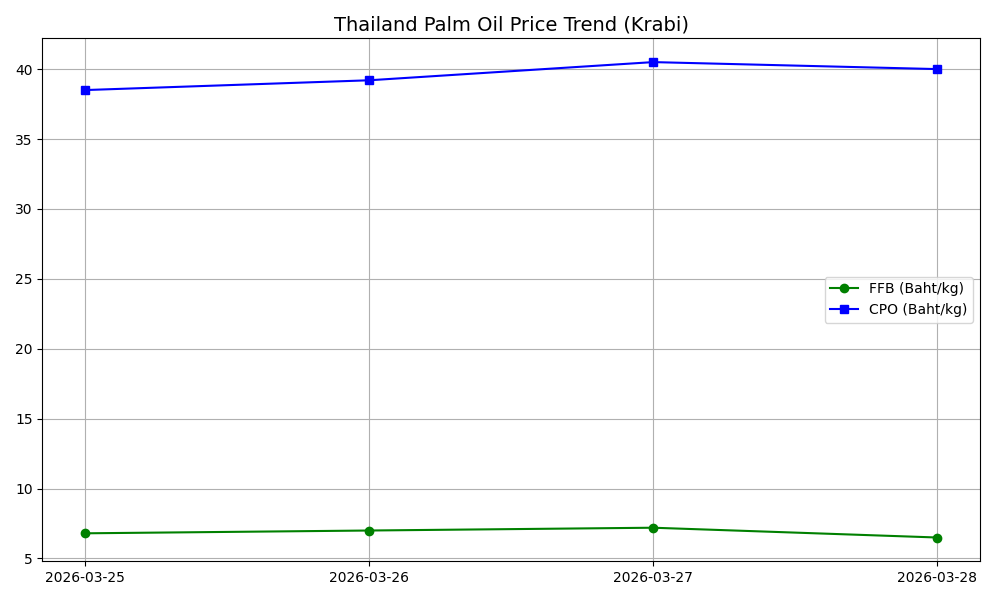

## 每日簡報：泰國甲米棕櫚油產業 (2026年03月28日)

**致：甲米壓榨廠老闆**

親愛的老闆，

今天是2026年3月28日，根據最新的市場情報和政府公告，以下是您今日需關注的關鍵點，以協助您制定經營策略：

### **一、 市場概況與政府介入**

1.  **全面性的價格管制與加強檢查：** 泰國商務部正加大力度對包括棕櫚油在內的必需品進行日常檢查，以防止囤積和哄抬物價。從3月1日到26日，部委已展開消費者保護行動，並計劃將棕櫚油、衛生紙、洗髮水、洗滌劑和肥皂等更多商品納入價格凍結的範圍。這意味著您在銷售精煉棕櫚油產品時將面臨嚴格的價格上限。

2.  **零售價格凍結，生產成本上升：** 商務部堅稱瓶裝棕櫚油價格尚未上漲，並強調供應充足。然而，市場報告顯示，由於生產成本提高，包括棕櫚油在內的必需品零售價格已有所上漲。這對您的壓榨廠形成直接挑戰：您的製造成本在上升，但下游銷售價格卻受到政府嚴格限制，利潤空間將受到擠壓。

3.  **「泰國幫助泰國」計畫啟動：** 商務部將於4月起推出「泰國幫助泰國」計畫，旨在穩定物價。這可能涉及對特定產品或行業的補貼，但也可能伴隨更嚴格的價格控制。

### **二、 能源成本與生物柴油政策**

1.  **燃料成本持續攀升：** 能源危機仍在持續，燃油成本上漲是推高包括棕櫚油在內必需品價格的兩大主要因素之一。這將直接影響您的運輸、生產和營運成本。政府已表示擁有約95天的石油儲備，並正在實施多項措施以確保供應。總理已下令對燃料價格進行全國性打擊。

2.  **生物柴油需求強勁：** 另一個推高棕櫚油價格的關鍵因素是政府推廣生物柴油的政策。泰國政府已將生物燃料混合比例從5%提高到7% (B7)，這將大量原棕櫚油（CPO）轉向燃料生產。雖然這為原棕櫚油提供了強勁的國內需求支撐，有助於維持原棕櫚油價格，但由於政府同時也在控制消費端價格，這種內在需求與外部管制之間的拉鋸，可能導致產業鏈中段利潤被壓縮。

3.  **限制石油出口：** 政府已將石油出口量從每天20萬公升減少至約5萬公升，顯示出對國內能源供應的優先關注。

### **三、 對您壓榨廠的影響與建議**

*   **原棕櫚果（FFB）採購：** 儘管原棕櫚油（CPO）需求因生物柴油政策而旺盛，但由於政府對終端產品價格的嚴格控制，您的壓榨廠支付給農民的FFB價格可能受到上限壓力，以維持微薄的利潤。您需要密切關注FFB供應量與當地採購價格的動態，確保原料供應的穩定性。
*   **原棕櫚油（CPO）銷售：** 生物柴油行業將是您CPO產品的主要需求方，價格可能得到一定支撐。但用於食用油的CPO銷售，將面臨政府設定的價格天花板，可能無法完全反映生產成本的上升。您可能需要審慎規劃CPO的銷售去向，平衡生物柴油市場與食用油市場的需求。
*   **營運成本控制：** 隨著能源和運輸成本的上升，請務必加強生產效率管理，優化物流，並審查所有營運開支，以應對不斷縮小的利潤空間。
*   **政策風險：** 商務部正準備將更多商品納入價格管制清單，並收緊價格上漲規則。您必須保持警惕，密切關注政府公告，特別是針對棕櫚油行業的任何新規定。

### **四、 短期展望**

預計未來幾週，政府對必需品價格的監管將持續高壓。4月初「泰國幫助泰國」計畫的啟動以及商務部擴大價格管制清單的審議，都可能帶來新的市場變數。密切關注這些政策動態，將是您穩定經營的關鍵。

希望這份簡報能為您的日常決策提供有價值的參考。

此致，

[您的姓名/職稱]
資深泰國棕櫚油產業策略師

---
DATA_JSON: {"ffb": 6.5, "cpo": 40.0}

## 📈 價格趨勢
